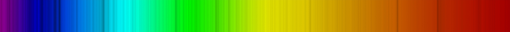

[](https://shields.io/)
# Spaceye :milky_way:

Spaceye is something hit my mind :brain: when I was reading :blue_book: "Introductation to Astrophsics" by Baidyanath Basu which said we can get informatation about some
celestial bodies from thier spectrum.So I set out to make a tool that extract this informatation from the spectrum.

Spectrum is basically a collection of all the colors in the image split up this can be taken from spectrometers u can make a spectrometer at home for <a href="https://www.youtube.com/watch?v=IA5BTD-aelo">10$</a>
<br>
It looks like:




## What Does Space Do :ballot_box_with_check:
It takes a spectrum image finds the color-graph find the adsorption lines the does some data crunching to find the corresponding elements, then also uses doppler shift
to find the speed(radial velocity) :racing_car: , and matches with the star type to find an Idea about temperarture :thermometer: and wieght

It also has a feature where we can take in video of celestial :ringed_planet: body to find its rotation time

This all is packaged in a simple GUI.


### How to use :gear:

**Step 1: clone the repo**
```
git clone https://github.com/Blackcipher101/Spaceye.git
```
**Step 2: install required packages**
```
pip install opencv-python
pip install PySimpleGUI
```
**Step3: Showtime**
```
python3 main.py
```
:partying_face: Ça suffit! :partying_face:

### Workflow

#### Startup


#### Selection of file


#### Color graph


#### Adsoption lines
Here can adjust the amount of accuracy you want the set in such a way you don't have many lines but some promient lines. 


#### Final 
Enter your start and end frquency of the spectrometer try looking up <a href="https://spectralworkbench.org/spectrums?page=2">spectralbench</a> if you don't know


#### Note: `-` sign stands for going away from us
Yaah its all done that simple right,

I have cross-verified the elements with what are mostly find in those type of stars and it matches up 90% of the time and also the speed and weight numbers.

#### Rotation
Enter the duration of the video 
an leave it


I missed the accurate rotation time by 0.74 days which is 27 days
Disclamer:Only gives rotation of the middle part as in some celestial bodies different regions have differnt times

### Contribution :handshake:
Feel Free to make issues and send PRs :innocent:

### License
All the images used were from <a href="http://spectralworkbench.org/">spectral bench</a> provided by public lab
and the video was picked from <a href="https://www.nasa.gov/mission_pages/soho/the-sun-daily/index.html">SOHO</a> webisite


